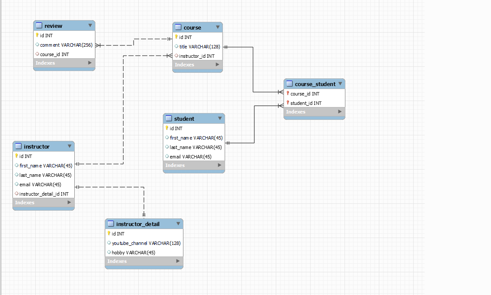

# JPA-Mapping

This repository demonstrates various **JPA (Java Persistence API)** mapping types in a Spring Boot project. It provides examples of different relationships between entities, such as One-to-One, One-to-Many, and Many-to-Many mappings.

## Project Structure

The repository is organized into the following directories:

- **ManyToMany**: Demonstrates a Many-to-Many relationship mapping between entities.
- **OneToMany**: Shows a bidirectional One-to-Many relationship mapping.
- **OneToMany-uni**: Example of a unidirectional One-to-Many relationship.
- **OneToOne-Unidirection**: Illustrates a unidirectional One-to-One relationship.
- **OneToOne-bi-directional**: Demonstrates a bidirectional One-to-One relationship.

## Technologies Used

- **Java**
- **Spring Boot**
- **JPA (Java Persistence API)**

